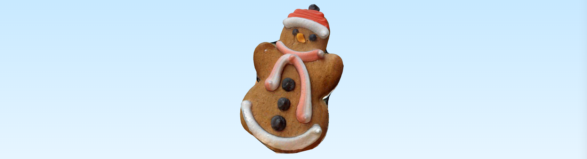
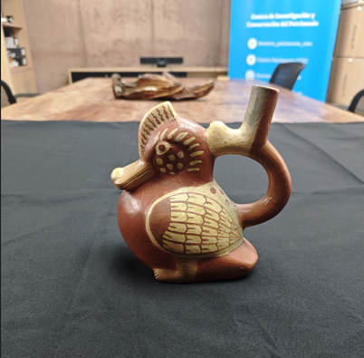
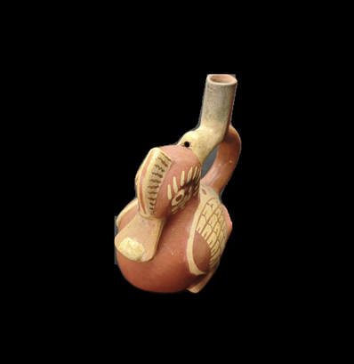
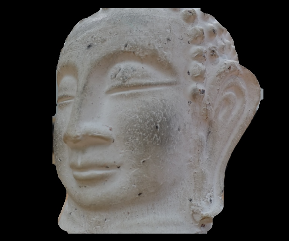
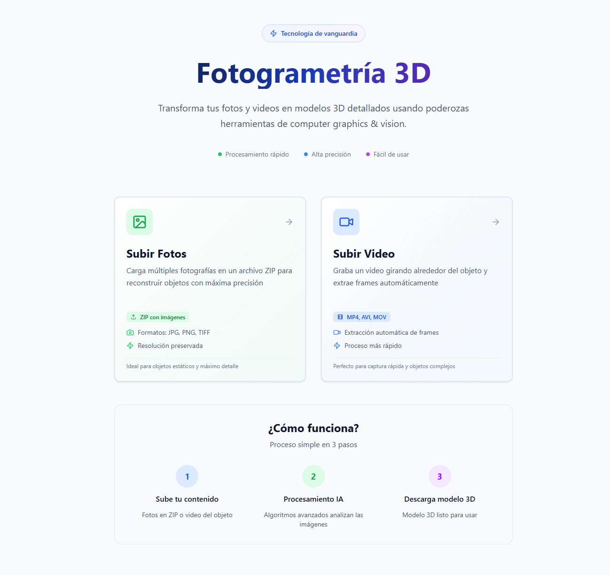
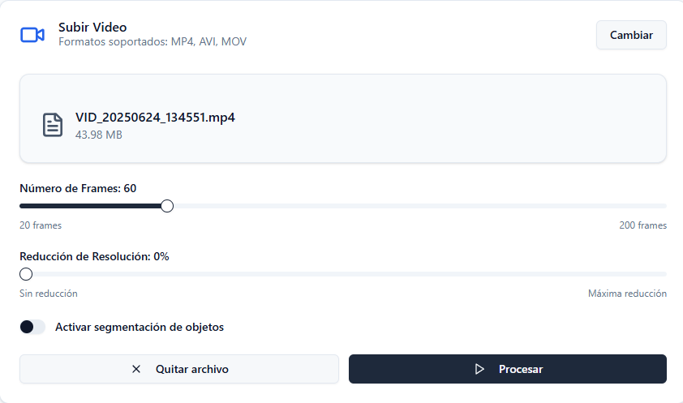
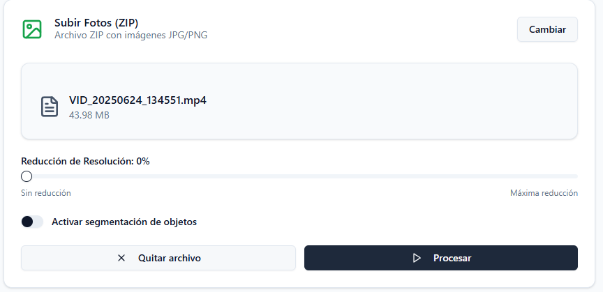
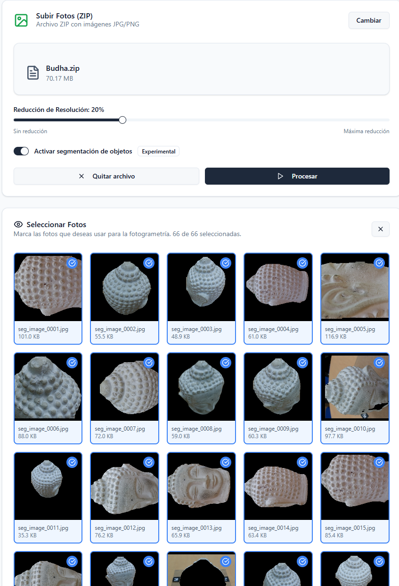

# 📸 REALFUSSION - Fotogrametría acelerada por gpu


Un sistema completo de fotogrametría acelerado por GPU que transforma videos o colecciones de fotografías en modelos 3D precisos y texturizados. Diseñado para eliminar automáticamente superficies de apoyo y fondos no deseados, generando modelos 3D limpios del objeto de interés.

---

## 🎯 Descripción General

Este proyecto revoluciona el proceso tradicional de fotogrametría mediante la integración de inteligencia artificial y algoritmos avanzados de visión por computadora. El sistema automatiza completamente el flujo desde la captura hasta el modelo 3D final, con especial énfasis en la limpieza automática de elementos no deseados como superficies de apoyo, fondos complejos y objetos secundarios.

### Ventajas de la Segmentación Automática

La funcionalidad de segmentación inteligente representa uno de los avances más significativos del sistema:





**🎯 Eliminación de Superficies de Apoyo**
- Detecta y elimina automáticamente mesas, soportes, y otras superficies donde se coloca el objeto
- Evita que elementos de apoyo interfieran con la geometría del modelo final
- Produce modelos 3D limpios enfocados únicamente en el objeto de interés

**🌟 Separación de Fondos Complejos**
- Maneja fondos complejos con texturas, patrones o múltiples objetos
- Elimina elementos distractores que podrían confundir al algoritmo de reconstrucción
- Mejora significativamente la calidad de las correspondencias de features

**⚡ Optimización del Pipeline**
- Reduce el tiempo de procesamiento al enfocar la reconstrucción únicamente en el objeto relevante
- Minimiza puntos 3D espurios provenientes del fondo
- Mejora la densidad y calidad de la malla resultante

---

## 🏗️ Arquitectura del Sistema


### Stack Tecnológico

#### Backend (API)
- **FastAPI**: Framework web moderno y rápido para Python
- **OpenCV**: Procesamiento de imágenes y visión por computadora
- **COLMAP**: Software de fotogrametría para Structure from Motion (SfM)
- **OpenMVS**: Multi-View Stereo reconstruction
- **YOLO v11**: Detección y segmentación de objetos en tiempo real
- **Docker**: Containerización con soporte NVIDIA

#### Frontend
- **Next.js 15.4**: Framework React con renderizado híbrido
- **TypeScript**: Tipado estático para mayor robustez
- **Tailwind CSS**: Framework de estilos utilitarios

#### Infraestructura
- **NVIDIA Container Toolkit**: Soporte GPU en contenedores
- **CUDA 12.0+**: Computación paralela en GPU
- **Docker Compose**: Orquestación de servicios

---

## 🔬 Tecnologías y Técnicas Utilizadas

### 1. Structure from Motion (SfM) - COLMAP

COLMAP es la columna vertebral del proceso de reconstrucción 3D:

**a) Extracción de Características (Feature Extraction)**
- Utiliza descriptores SIFT (Scale-Invariant Feature Transform)
- Detecta puntos de interés únicos en cada imagen
- Aceleración GPU para procesamiento masivo

**b) Correspondencia de Características (Feature Matching)**
- Algoritmo de emparejamiento exhaustivo
- Encuentra puntos correspondientes entre múltiples imágenes
- Filtrado robusto de outliers

**c) Reconstrucción Incremental**
- Estimación de poses de cámara
- Triangulación de puntos 3D
- Bundle Adjustment para optimización global

### 2. Multi-View Stereo (MVS) - OpenMVS

Proceso de densificación y generación de malla:

**a) Densificación de Nube de Puntos**
- Algoritmos de stereo matching
- Estimación de profundidad densa
- Filtrado de ruido y outliers

**b) Reconstrucción de Malla**
- Algoritmo Poisson Surface Reconstruction
- Decimación adaptativa para optimización
- Preservación de detalles importantes

**c) Texturización**
- Proyección de texturas desde múltiples vistas
- Fusión de colores para consistencia
- Generación de mapas UV optimizados

### 3. Segmentación Inteligente - YOLO v11

Sistema avanzado de detección y segmentación para eliminar elementos no deseados:

**a) Detección de Objetos**
- Red neuronal convolucional en tiempo real
- Detección de múltiples clases de objetos
- Confianza adaptativa según la calidad de imagen

**b) Segmentación de Instancias para Fotogrametría**
- Máscaras precisas a nivel de píxel del objeto principal
- **Eliminación automática de superficies de apoyo**: Detecta y remueve mesas, soportes, pedestales
- **Separación inteligente de fondos**: Maneja fondos complejos con texturas y patrones
- Algoritmos de post-procesamiento morfológico para refinar bordes

**c) Selección de Objeto Principal Optimizada para 3D**
- Métricas de importancia específicas para fotogrametría:
  - Centralidad en la imagen (objetos centrados son preferidos)
  - Área relativa óptima (evita objetos muy pequeños o que ocupan toda la imagen)
  - Compacidad del objeto (favorece formas sólidas vs dispersas)
  - Solidez de la forma (discrimina objetos reales vs ruido)
- **Filtrado anti-fondo**: Detecta y rechaza automáticamente máscaras que representan el fondo
- **Prevención de superficies**: Evita seleccionar la mesa o superficie como objeto principal

**Beneficios para la Reconstrucción 3D:**
- Modelos finales libres de elementos de apoyo o fondo
- Mayor densidad de puntos 3D en el objeto de interés
- Reducción significativa de artefactos en la malla
- Texturas más limpias sin interferencias del entorno



### 4. Análisis de Calidad de Frames

Algoritmos sofisticados para selección automática:

**a) Métricas de Nitidez**
- Varianza del Laplaciano para detectar desenfoque
- Análisis de gradientes para evaluar bordes
- Umbralización adaptativa por video

**b) Análisis de Calidad Global**
- Evaluación de contraste (desviación estándar)
- Métricas de exposición (histograma)
- Entropía de información
- Score compuesto ponderado

**c) Filtrado de Similitud**
- Comparación de histogramas HSV
- Correlación entre frames consecutivos
- Prevención de redundancia temporal

---

## 🛠️ Instalación y Configuración

### Prerrequisitos del Sistema

```bash
# Hardware mínimo recomendado
- GPU NVIDIA con CUDA Compute Capability 6.0+
- 8GB RAM mínimo (16GB recomendado)
- 50GB espacio libre en disco
- Ubuntu 20.04+ / Windows 10+ con WSL2

# Software requerido
- Docker Engine 20.10+
- Docker Compose 2.0+
- NVIDIA Container Toolkit
- Git
```

### 1. Configuración de NVIDIA Container Toolkit

#### Ubuntu/Linux:
```bash
# Agregar repositorio oficial de NVIDIA
curl -fsSL https://nvidia.github.io/libnvidia-container/gpgkey | sudo gpg --dearmor -o /usr/share/keyrings/nvidia-container-toolkit-keyring.gpg
curl -s -L https://nvidia.github.io/libnvidia-container/stable/deb/nvidia-container-toolkit.list | \
  sed 's#deb https://#deb [signed-by=/usr/share/keyrings/nvidia-container-toolkit-keyring.gpg] https://#g' | \
  sudo tee /etc/apt/sources.list.d/nvidia-container-toolkit.list

# Instalar toolkit
sudo apt-get update
sudo apt-get install -y nvidia-container-toolkit

# Configurar Docker daemon
sudo nvidia-ctk runtime configure --runtime=docker
sudo systemctl restart docker

# Verificar instalación
docker run --rm --gpus all nvidia/cuda:12.0-base nvidia-smi
```

#### Windows WSL2:
```bash
# Seguir la guía oficial de NVIDIA para WSL2
# https://docs.nvidia.com/cuda/wsl-user-guide/index.html

# Verificar que WSL2 detecta la GPU
nvidia-smi.exe
```

### 2. Clonación e Instalación del Proyecto

```bash
# Clonar el repositorio
git clone <repository-url>
cd photogrammetry

# Construir la imagen Docker del backend
docker build -t photogrammetry-api .

# Iniciar servicios con Docker Compose
docker-compose up -d

# Verificar que el backend está funcionando
curl http://localhost:8000/docs
```

### 3. Configuración del Frontend

```bash
# Navegar a la carpeta del frontend
cd frontend

# Instalar dependencias de Node.js
npm install

# Iniciar servidor de desarrollo
npm run dev

# El frontend estará disponible en http://localhost:3000
```

---

## 🚀 Uso del Sistema

### Interface Web (Recomendado)

1. **Acceso a la Aplicación**
   ```
   Frontend: http://localhost:3000
   API Docs: http://localhost:8000/docs
   ```



2. **Modalidades de Entrada**

#### 🎬 Modo Video
- Carga un archivo de video (MP4, AVI, MOV, etc.)
- Configura el número objetivo de frames (automático o manual)
- **Opción de Segmentación**: Activa la separación automática del objeto principal
- El sistema analiza calidad, extrae los mejores frames y opcionalmente segmenta objetos



#### 📁 Modo ZIP de Imágenes  
- Carga un archivo ZIP con tu colección de fotografías
- **Control de Resolución**: Reduce la resolución (0-50%) para acelerar el procesamiento
- **Opción de Segmentación**: Elimina fondos y superficies de apoyo automáticamente
- Ideal para colecciones fotográficas profesionales ya capturadas
- **Selector de images**: Permite elegir imágenes específicas dentro del ZIP antes de procesar




3. **Configuración de Parámetros**
   - **Segmentación**: ON/OFF según si deseas eliminación automática de fondos
   - **Reducción de Calidad**: 0% (máxima calidad) a 50% (máxima velocidad)
   - **Número de Frames**: Automático o especificado manualmente

4. **Ejecución y Monitoreo**
   - Visualización en tiempo real del progreso del pipeline
   - Métricas de calidad y estadísticas de procesamiento
   - Descarga automática del modelo 3D resultante


### API REST

#### 1. Extracción de Frames desde Video

```bash
curl -X POST "http://localhost:8000/extractframes" \
  -H "Content-Type: multipart/form-data" \
  -F "video=@mi_video.mp4" \
  -F "num_frames=60" \
  -F "segment_objects=true"
```

**Parámetros del Modo Video:**
- `video`: Archivo de video (MP4, AVI, MOV, MKV, etc.)
- `num_frames`: Número objetivo de frames (automático si se omite)
- `segment_objects`: **Activar segmentación para eliminar superficies de apoyo y fondos**

**Ventajas de la Segmentación en Video:**
- Elimina automáticamente la mesa o superficie donde está el objeto
- Remueve fondos complejos que pueden confundir el algoritmo
- Produce modelos más limpios sin elementos no deseados

#### 2. Subida de Fotos desde ZIP

```bash
curl -X POST "http://localhost:8000/uploadphotos" \
  -H "Content-Type: multipart/form-data" \
  -F "photos_zip=@mis_fotos.zip" \
  -F "segment_objects=true" \
  -F "reduction_percentage=20"
```

**Parámetros del Modo ZIP:**
- `photos_zip`: Archivo ZIP con imágenes (JPG, PNG, TIFF, BMP)
- `segment_objects`: **Segmentación automática para eliminar fondos y soportes**
- `reduction_percentage`: **Control de calidad vs velocidad (0-50%)**
  - `0%`: Máxima calidad, mayor tiempo de procesamiento
  - `20%`: Balance óptimo calidad-velocidad
  - `50%`: Máxima velocidad, menor calidad final

**Optimización Calidad-Velocidad:**
- **Sin Reducción (0%)**: Modelos de máxima resolución, tiempo completo
- **Reducción Moderada (20-30%)**: 40-60% menos tiempo, calidad excelente
- **Reducción Alta (40-50%)**: 70-80% menos tiempo, calidad buena para prototipos

#### 3. Ejecución del Pipeline de Fotogrametría

```bash
curl -X POST "http://localhost:8000/photogrammetry"
```

Este endpoint ejecuta el pipeline completo:
1. Extracción de características SIFT
2. Emparejamiento de características
3. Reconstrucción SfM (Structure from Motion)
4. Generación de imágenes sin distorsión
5. Conversión de modelos
6. Interfaz COLMAP-MVS
7. Densificación de nube de puntos
8. Reconstrucción de malla 3D
9. Texturización del modelo
10. Empaquetado de resultados

#### 4. Descarga de Resultados

```bash
curl -O http://localhost:8000/download/photogrammetry_result.zip
```

---

## ⚙️ Configuración Avanzada

### Parámetros del Pipeline

El sistema permite ajustar múltiples parámetros para optimizar resultados:

#### Extracción de Frames
```python
# En utils/extractPhotosFromVideo.py
extract_frames_smart(
    video_path="video.mp4",
    target_frames=60,        # Número objetivo de frames
    quality=95,              # Calidad JPEG (1-100)
    max_similarity=0.85,     # Umbral de similitud máxima
    analysis_sample=0.1      # Fracción del video para análisis
)
```

#### Segmentación de Objetos para Fotogrametría
```python
# En utils/segmentImages.py
segment_images_for_photogrammetry(
    confidence=0.3,              # Umbral de confianza YOLO
    min_area_ratio=0.08,         # Área mínima del objeto (8% de la imagen)
    prefer_centered_objects=True, # Preferir objetos centrados
    # Parámetros específicos para eliminar superficies de apoyo
    filter_background=True,       # Detectar y rechazar fondos
    remove_support_surfaces=True  # Eliminar mesas y soportes
)
```

#### Control de Calidad vs Velocidad
```python
# Configuraciones recomendadas por escenario
scenarios = {
    "maximum_quality": {
        "reduction_percentage": 0,      # Sin reducción
        "resolution_level": 1,          # Máxima resolución MVS
        "target_face_num": 200000       # Malla de alta densidad
    },
    "balanced": {
        "reduction_percentage": 20,     # Reducción moderada
        "resolution_level": 2,          # Resolución estándar
        "target_face_num": 100000       # Malla balanceada
    },
    "fast_prototype": {
        "reduction_percentage": 40,     # Reducción alta
        "resolution_level": 3,          # Resolución rápida
        "target_face_num": 50000        # Malla ligera
    }
}
```

#### Pipeline COLMAP/OpenMVS
```bash
# Configuraciones principales en app.py
--SiftExtraction.use_gpu 1      # Usar GPU para SIFT
--resolution-level 2            # Nivel de resolución MVS
--decimate 0.4                  # Factor de decimación de malla
--target-face-num 100000        # Número objetivo de faces
```

### Optimización de Rendimiento

#### GPU Memory Management
```yaml
# En docker-compose.yml
deploy:
  resources:
    reservations:
      devices:
        - driver: nvidia
          count: all
          capabilities: [gpu]
```

#### Timeouts y Recursos
```python
# Timeouts por paso del pipeline
feature_extraction: 600s    # 10 minutos
feature_matching: 600s      # 10 minutos  
sfm_reconstruction: 1200s   # 20 minutos
densification: 1800s        # 30 minutos
mesh_reconstruction: 100s   # 1.7 minutos
texturing: 60s              # 1 minuto
```

---

## 📊 Métricas y Calidad

### Indicadores de Calidad del Pipeline

El sistema proporciona métricas detalladas para evaluar la calidad del proceso:

#### Análisis de Frames (Modo Video)
- **Nitidez**: Varianza del Laplaciano (>100 recomendado)
- **Contraste**: Desviación estándar (>30 recomendado)
- **Exposición**: Distribución de píxeles (evitar extremos)
- **Entropía**: Información contenida (>6 bits recomendado)

#### Efectividad de Segmentación
- **Tasa de Éxito**: Porcentaje de imágenes segmentadas exitosamente
- **Objeto Principal Detectado**: Confirmación de detección del objeto de interés
- **Superficies de Apoyo Eliminadas**: Detección y remoción de elementos no deseados
- **Área del Objeto**: Ratio del objeto respecto a la imagen total (8-60% óptimo)
- **Centralidad**: Posición del objeto en la imagen (>70% para mejores resultados)
- **Limpieza del Fondo**: Efectividad en la eliminación de elementos distractores

#### Reconstrucción 3D
- **Número de Features**: Puntos SIFT detectados por imagen
- **Matches**: Correspondencias encontradas entre imágenes
- **Puntos 3D**: Cantidad en la nube de puntos densa
- **Faces de Malla**: Resolución del modelo final
- **Calidad de Textura**: Resolución y consistencia del mapeado UV

#### Optimización Calidad-Velocidad
- **Tiempo de Procesamiento**: Comparativa entre configuraciones
- **Tamaño del Modelo Final**: Balance entre detalle y tamaño de archivo
- **Efectividad de Reducción**: Impacto de la reducción de resolución en la calidad

### Interpretación de Resultados

```json
{
  "success": true,
  "message": "Pipeline de fotogrametría completado exitosamente",
  "frames_extracted": 45,
  "segmentation_info": {
    "segmented": true,
    "segmented_images": 42,
    "original_images": 45,
    "success_rate": 93.3,
    "objects_cleaned": ["support_surface", "background_clutter"],
    "main_object_detected": true
  },
  "quality_optimization": {
    "reduction_percentage": 20,
    "processing_time_saved": "45%",
    "quality_retained": "95%"
  },
  "zip_file": {
    "filename": "photogrammetry_result.zip",
    "size_bytes": 15728640,
    "contains": ["scene_textured.obj", "scene_textured.mtl", "texture_0001.jpg"]
  },
  "execution_time_seconds": 180.5,
  "model_statistics": {
    "vertices": 25690,
    "faces": 51380,
    "texture_resolution": "2048x2048",
    "surface_cleaned": true
  }
}
```

**Interpretación de Métricas Clave:**

- **success_rate > 90%**: Excelente calidad de segmentación
- **objects_cleaned**: Elementos no deseados removidos exitosamente
- **surface_cleaned: true**: Superficies de apoyo eliminadas correctamente
- **processing_time_saved**: Beneficio de la optimización de velocidad
- **quality_retained**: Porcentaje de calidad preservada con optimización

---

## 🔧 Troubleshooting

### Problemas Comunes

#### 1. Error de GPU No Detectada
```bash
# Verificar detección de GPU
nvidia-smi
docker run --gpus all nvidia/cuda:12.0-base nvidia-smi

# Si falla, reinstalar NVIDIA Container Toolkit
sudo apt-get install --reinstall nvidia-container-toolkit
sudo systemctl restart docker
```

#### 2. Memoria GPU Insuficiente
```bash
# Reducir resolución de imágenes
reduction_percentage=20  # Reducir 20%

# O ajustar parámetros del pipeline
--resolution-level 3     # Usar nivel 3 en lugar de 2
```

#### 3. Pocos Frames Extraídos
```bash
# Usar configuración más permisiva
extract_frames_permissive(video_path, target_frames=100)

# O ajustar umbrales
max_similarity=0.95      # Permitir más similitud
quality_threshold=0.1    # Umbral más bajo
```

#### 4. Segmentación Fallida o Inefectiva
```bash
# Problema: El sistema no detecta el objeto principal correctamente
# Solución: Ajustar parámetros de detección

# Usar confianza más baja para objetos difíciles de detectar
confidence=0.2
min_area_ratio=0.05

# O desactivar segmentación para objetos muy complejos
segment_objects=false

# Verificar que el objeto esté centrado en las imágenes
prefer_centered_objects=true
```

#### 5. Optimización de Velocidad vs Calidad
```bash
# Problema: El procesamiento es muy lento
# Solución: Ajustar parámetros de velocidad

# Para prototipado rápido
reduction_percentage=40    # Reducir resolución 40%
resolution_level=3        # Usar nivel más rápido

# Para producción balanceada
reduction_percentage=20    # Reducción moderada
resolution_level=2        # Balance estándar

# Para máxima calidad (más lento)
reduction_percentage=0     # Sin reducción
resolution_level=1        # Máxima resolución
```

#### 6. Modelos con Superficies de Apoyo
```bash
# Problema: El modelo incluye la mesa o superficie de apoyo
# Solución: Activar o mejorar segmentación

# Forzar segmentación más agresiva
segment_objects=true
confidence=0.25            # Confianza moderada-baja
min_area_ratio=0.06       # Área mínima más permisiva

# Verificar que las imágenes muestren claramente el objeto separado del fondo
# Considerar recapturar con mejor contraste objeto-fondo
```

#### 5. Pipeline de Fotogrametría Falla

**Insufficient Features:**
```bash
# Verificar número de imágenes (mínimo 10-15)
# Asegurar overlap entre imágenes (>60%)
# Verificar calidad de las imágenes
```

**SfM Reconstruction Fails:**
```bash
# Revisar que las imágenes muestren el mismo objeto
# Verificar variación de viewpoints
# Considerar usar más imágenes
```

**Texturing Issues:**
```bash
# Verificar que las imágenes originales estén disponibles
# Revisar que la malla se haya generado correctamente
# Comprobar espacio en disco suficiente
```

### Logs y Debugging

```bash
# Ver logs del contenedor
docker logs openmvs-container -f

# Ejecutar en modo debug
docker-compose up --build

# Acceder al contenedor para debug
docker exec -it openmvs-container bash
```

---

## 📚 Referencias y Recursos

### Documentación Técnica
- [COLMAP Documentation](https://colmap.github.io/)
- [OpenMVS Documentation](https://github.com/cdcseacave/openMVS)
- [YOLO Documentation](https://docs.ultralytics.com/)
- [FastAPI Documentation](https://fastapi.tiangolo.com/)
- [Next.js Documentation](https://nextjs.org/docs)

### Papers Científicos
- Schönberger, J. L. & Frahm, J. M. (2016). Structure-from-Motion Revisited. CVPR.
- Cernea, D. (2020). OpenMVS: Multi-view stereo reconstruction library.
- Redmon, J., et al. (2016). You Only Look Once: Unified, Real-Time Object Detection.

### Recursos Adicionales
- [NVIDIA Container Toolkit Setup](https://docs.nvidia.com/datacenter/cloud-native/container-toolkit/latest/install-guide.html)
- [Docker GPU Support](https://docs.docker.com/config/containers/resource_constraints/#gpu)
- [Photogrammetry Best Practices](https://en.wikipedia.org/wiki/Photogrammetry)

---

## 📄 Licencia

Este proyecto está licenciado bajo la Licencia GNU. Ver el archivo `LICENSE` para más detalles.

---

## 👥 Equipo de Desarrollo

**Ver** `CONTRIBUTORS.md`

Para soporte técnico o consultas: [email de contacto]

---

*Última actualización: 23 de junio del 2025*